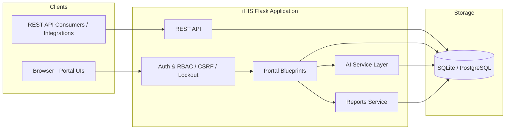
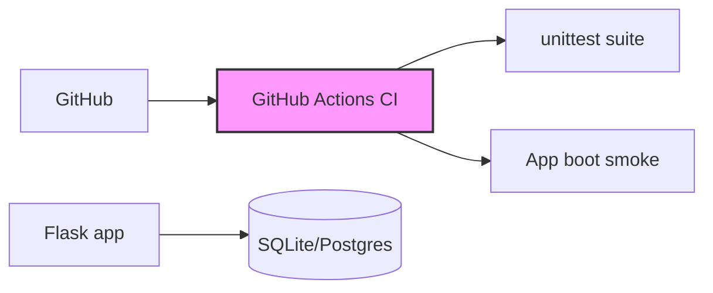

# iHIS — Intelligent Health Information System

Architecture, module map, and deployment notes for the iHIS prototype.

## High-Level Architecture

## Blueprints / Portals

```mermaid
flowchart TD
    M[main.home / main.dashboard]

    A[patient] --> P1[Appointments]
    A --> P2[AI Health Insights]
    A --> P3[Medical Records]

    D[doctor] --> D1[Patients List]
    D --> D2[Medical Records]
    D --> D3[AI Summary / Diagnosis Support]
    D --> D4[Prescriptions]
    D --> D5[Lab & Radiology Orders]

    L[lab] --> L1[Test Catalog]
    L --> L2[Orders & Results]
    L --> L3[AI Lab Interpretation]

    R[radiology] --> R1[Orders]
    R --> R2[Reports & Uploads]
    R --> R3[AI Radiology Assistant]

    PH[pharmacy] --> PH1[Prescriptions]
    PH --> PH2[Inventory]
    PH --> PH3[Dispensing]
    PH --> PH4[AI Prescription Check]

    N[nursing] --> N1[Vitals]
    N --> N2[Nursing Notes]
    N --> N3[Care Plans]

    RC[reception] --> RC1[Book Appointments]
    RC --> RC2[Check-In Patients]

    DE[dentistry] --> DE1[Dental Records & Charts]
    DE --> DE2[Procedures]
    DE --> DE3[Orthodontics]

    PT[physiotherapy] --> PT1[Assessments]
    PT --> PT2[Therapy Plans]
    PT --> PT3[AI Rehab Assistant]

    AD[admin] --> AD1[Staff & Departments]
    AD --> AD2[Statistics]
    AD --> AD3[Reports Center]

    SA[super_admin] --> SA1[Users & Roles]
    SA --> SA2[Permissions]
    SA --> SA3[Audit Logs]
    SA --> SA4[Settings & Backup]

    CR[care] --> CR1[Referrals]
    CR --> CR2[Care Teams]
    CR --> CR3[MD Cases]
```

## AI Layer (`app/services/ai/ai_interfaces.py`)

Rule-based clinical decision-support modules (no external model dependency):

- `AIClinicalAssistant` — consultations / care suggestions
- `AIDiagnosisSupport` — ICD-10 aware differential suggestions
- `AIPatientRiskPrediction` — risk score + level
- `AILaboratoryInterpretation` — abnormality detection (e.g. HbA1c 8.2 → abnormal)
- `AIDrugInteractionEngine` — uses the `DrugInteraction` table
- `AIPrescriptionChecker` — safety review
- `AIRadiologyAssistant` — imaging summaries
- `AIAppointmentOptimization` — scheduling suggestions
- `AIMedicalCodingAssistant` — code suggestions
- `AIHospitalAnalytics` — operational insights
- `AIRehabilitationAssistant` — progress/exercise/outcome planning

Exposed via the `/ai` blueprint; each portal whose data is consumed by AI
links to the relevant AI screen.

## Security

- Global CSRF protection (Flask-WTF `CSRFProtect`); the JSON REST API is `csrf.exempt`.
- `roles_required` / `roles_any` / `permissions_required` decorators in `app/routes/decorators.py`.
- Account lockout: after `MAX_LOGIN_ATTEMPTS` (default 5) failures the account is
  locked for `LOCKOUT_MINUTES` (default 15); every attempt recorded in `LoginAttempt`.
- Activity audit trail via `AuditLog` (`log_activity`).

## Reports

`app/services/reports/` generates PDF reports (ReportLab): medical record, lab result,
radiology report, prescription, pharmacy inventory, hospital statistics. A central
**Reports Center** (`/reports/`) links all standalone PDFs.

## Deployment

- `python run.py` to start (development).
- `python seed.py` reseeds the demo database; all accounts use password `123456`.
- CI workflow: `.github/workflows/ci.yml`.