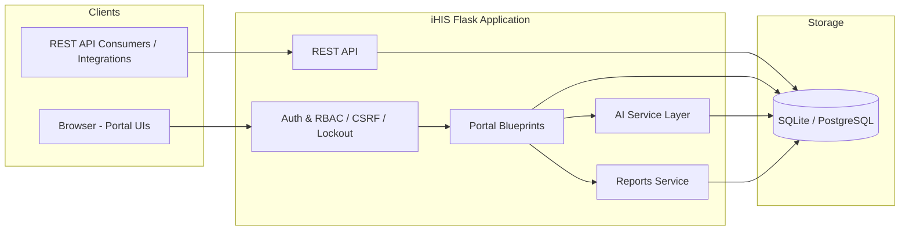
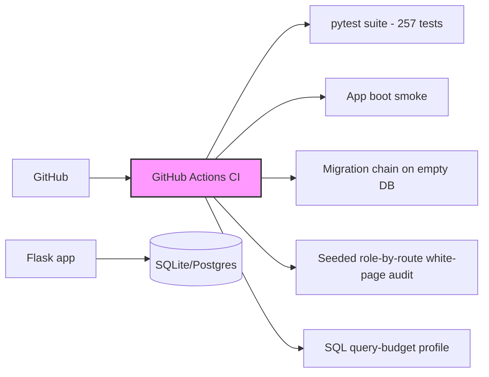

# iHIS — Intelligent Health Information System

Architecture, module map, and deployment notes for the iHIS prototype.

## High-Level Architecture

## Blueprints / Portals

```mermaid
flowchart TD
    M[main.home / main.dashboard]

    A[patient] --> P1[Appointments]
    A --> P2[AI Health Insights]
    A --> P3[Medical Records]

    D[doctor] --> D1[Patients List]
    D --> D2[Medical Records]
    D --> D3[AI Summary / Diagnosis Support]
    D --> D4[Prescriptions]
    D --> D5[Lab & Radiology Orders]

    L[lab] --> L1[Test Catalog]
    L --> L2[Orders & Results]
    L --> L3[AI Lab Interpretation]

    R[radiology] --> R1[Orders]
    R --> R2[Reports & Uploads]
    R --> R3[AI Radiology Assistant]

    PH[pharmacy] --> PH1[Prescriptions]
    PH --> PH2[Inventory]
    PH --> PH3[Dispensing]
    PH --> PH4[AI Prescription Check]

    N[nursing] --> N1[Vitals]
    N --> N2[Nursing Notes]
    N --> N3[Care Plans]

    RC[reception] --> RC1[Book Appointments]
    RC --> RC2[Check-In Patients]

    DE[dentistry] --> DE1[Dental Records & Charts]
    DE --> DE2[Procedures]
    DE --> DE3[Orthodontics]

    PT[physiotherapy] --> PT1[Assessments]
    PT --> PT2[Therapy Plans]
    PT --> PT3[AI Rehab Assistant]

    AD[admin] --> AD1[Staff & Departments]
    AD --> AD2[Statistics]
    AD --> AD3[Reports Center]

    SA[super_admin] --> SA1[Users & Roles]
    SA --> SA2[Permissions]
    SA --> SA3[Audit Logs]
    SA --> SA4[Settings & Backup]

    CR[care] --> CR1[Referrals]
    CR --> CR2[Care Teams]
    CR --> CR3[MD Cases]
```

## AI Layer (`app/services/ai/ai_interfaces.py`)

Rule-based clinical decision-support modules (no external model dependency):

- `AIClinicalAssistant` — consultations / care suggestions
- `AIDiagnosisSupport` — ICD-10 aware differential suggestions
- `AIPatientRiskPrediction` — risk score + level
- `AILaboratoryInterpretation` — abnormality detection (e.g. HbA1c 8.2 → abnormal)
- `AIDrugInteractionEngine` — uses the `DrugInteraction` table
- `AIPrescriptionChecker` — safety review
- `AIRadiologyAssistant` — imaging summaries
- `AIAppointmentOptimization` — scheduling suggestions
- `AIMedicalCodingAssistant` — code suggestions
- `AIHospitalAnalytics` — operational insights
- `AIRehabilitationAssistant` — progress/exercise/outcome planning

Exposed via the `/ai` blueprint; each portal whose data is consumed by AI
links to the relevant AI screen.

## Clinical Workbench (`app/routes/clinical.py`)

Native reimplementation of high-value reference EHR features (harvested from the
OpenMRS / Bahmni / OpenEMR / fhir-ui benchmark — see
`docs/OPEN_SOURCE_BENCHMARK.md` and `docs/FEATURE_GAP_MATRIX.md`). No reference
code was copied; patterns only.

- **Order sets** (`/clinical/order-sets*`) — reusable bundles of lab / imaging /
  medication / referral items. New sets are created **inactive** and must be
  explicitly activated before they can be applied to a patient (safety default:
  an unreviewed set is never applicable). Applying materialises real
  `LabOrder`, `RadiologyOrder`, `Prescription` and `Referral` records plus
  `Task` rows, then redirects to the patient 360 page. Access is guarded by
  `patient_access_required` (need-to-know).
- **Clinical templates** (`/clinical/templates*`) — SOAP / CONSULT / DISCHARGE /
  PROCEDURE / NURSING note structures stored as JSON sections
  (`ClinicianTemplate.sections`), scoped by specialty, so faster charting never
  bypasses documentation quality.
- **Clinical Inbox** (`/clinical/inbox`) — one place for unreviewed lab results,
  radiology reports, open alerts, referrals, interventions, drafts and reminders.
  Results are acknowledged via `ResultAcknowledgement` (idempotent upsert keyed
  on `result_type` + `result_id` + user); ack kind is `CRITICAL` for critical
  labs, else `REVIEW`.
- **Clinical Reminders** (`/clinical/reminders*)` — recall engine
  (`app/services/reminders.py`) that materialises due/overdue reminders from real
  records (follow-ups, immunizations due, monitoring/review items). Idempotent
  dedupe per patient/type/source; ack via `reminder_done`.
- **Verified Clinical Summary** (`/clinical/summary/<patient_id>`) — consolidated
  allergies, problems, active prescriptions, latest vitals, lab results,
  radiology, admissions, immunizations and open alerts, with need-to-know gating.
- **Smart patient header / safety strip** — the reusable
  `_patient_header.html` partial (banner with name/MRN/gender/DOB/blood type,
  active admission, latest vitals, active-medication chips) backed by the
  `PatientSafetyContext` service (`app/services/patient_safety.py`), which
  returns active allergies, open problems, open alerts and active medications
  (deduped, excluding cancelled items). It is included at the top of every
  single-patient clinical page across doctor, AI, pharmacy, nursing and
  dentistry blueprints so clinicians see allergy / problem / alert chips before
  acting (harvest: OpenMRS chart banner / FHIR PatientBanner, native). The
  Patient 360 page additionally renders the shared `_patient_safety_strip.html`.

New permissions: `ORDER_SET_VIEW/CREATE/EDIT`, `TEMPLATE_VIEW/CREATE/EDIT`,
`INBOX_VIEW`, `RESULT_ACK`, `REMINDER_VIEW`, `REMINDER_ACK`,
`CLINICAL_SUMMARY_VIEW` (see `app/permissions.py`).

## Shared clinical services (2026-09-06 audit)

| Module | Responsibility |
|--------|----------------|
| `app/access.py` | Need-to-know policy: `has_need_to_know`, `accessible_patient_ids`, `patient_access_required`, `require_patient_access` for all 13 roles (department, care team, authorship, today's appointment, admission, orders, specialty referrals, bills) |
| `app/services/clinical_orders.py` | The single creation path for lab orders, radiology orders, prescriptions and referrals: record → safety screen → task → timeline → notification; referral state machine (`transition_referral`) |
| `app/services/status.py` | Workflow state machines (lab order, radiology order, appointment, admission, therapy session, MAR) with `assert_transition` |
| `app/services/tasks.py` | Task engine incl. resource-scoped `complete_for_resource` / `cancel_for_resource` |
| `app/services/notifications.py` | `notify` with unread-duplicate suppression, `notify_users`, `care_team_user_ids`, `notify_ordering_clinicians` |
| `app/services/timeline.py` | `record_event` plus `merged_timeline`, which synthesises events for source records that predate the timeline |
| `app/services/billing.py` | PK-derived bill/receipt numbers, service-to-bill materialisation |
| `app/utils.py` | `LOCKED_STATUSES` (`Verified`, `Signed`, `Locked`, `Finalized`), MRN assignment, appointment conflict window |

Roles: SuperAdmin, Admin, Doctor, Nurse, LabTechnician, Radiologist,
RadiologyTechnician, Pharmacist, Physiotherapist, Dentist, Receptionist,
Cashier, Patient (`docs/ROLE_CAPABILITIES.md`).

## Security

- Global CSRF protection (Flask-WTF `CSRFProtect`); the JSON REST API is `csrf.exempt`.
- `roles_required` / `roles_any` / `permissions_required` decorators in `app/routes/decorators.py`.
- Account lockout: after `MAX_LOGIN_ATTEMPTS` (default 5) failures the account is
  locked for `LOCKOUT_MINUTES` (default 15); every attempt recorded in `LoginAttempt`.
- Activity audit trail via `AuditLog` (`log_activity`).

## Reports

`app/services/reports/` generates PDF reports (ReportLab): medical record, lab result,
radiology report, prescription, pharmacy inventory, hospital statistics. A central
**Reports Center** (`/reports/`) links all standalone PDFs.

## Deployment

- `python run.py` to start (development).
- `python seed.py` reseeds the demo database; all accounts use password `123456`.
- CI workflow: `.github/workflows/ci.yml`.